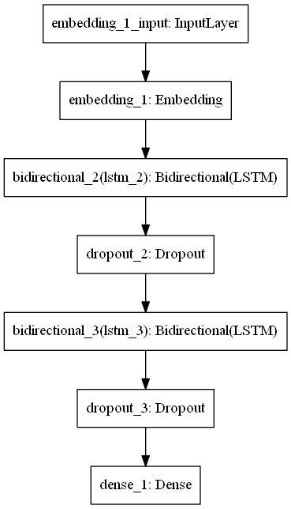
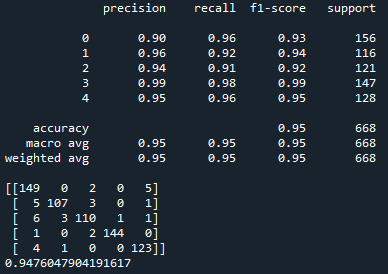
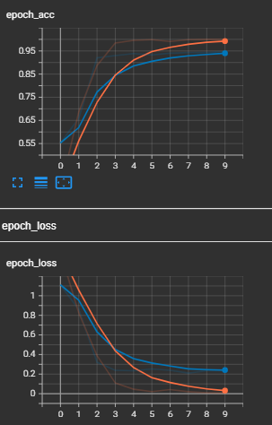

# Categorization of Media Articles
Text documents are essential as they are one of the richest sources of data for businesses. Text documents often contain crucial information which might shape
the market trends or influence the investment flows. Therefore, companies often hire analysts to monitor the trend via articles posted online, tweets on social media
platforms such as Twitter or articles from newspaper. However, some companies may wish to only focus on articles related to technologies and politics. Thus,
filtering of the articles into different categories is required. 

In this repository, I have created an LSTM deep learning model to ccategorize unseen articles into 5 categories namely Sport, Tech, Business, Entertainment and
Politics.

# Description
This repository contains 2 python files (train.py, modules.py).

train.py contains the codes to build a deep learning model and train on the dataset.

module.py contains the codes where there are class and functions to be used in train.py.

#How run Tensorboard

1. Clone this repository and use the model.h5, ohe.pkl and tokenizer_data.json(inside saved_model folder) to deploy on your dataset.
2. Run tensorboard at the end of training to see how well the model perform via Anaconda prompt. Activate the correct environment.
3. Type "tensorboard --logdir "the log path"
4. Paste the local network link into your browser and it will automatically redirected to tensorboard local host and done! Tensorboard is now can be analyzed.

# The Architecture of Model

# The Performance of model

# Tensorboard screenshot from my browser

# Discussion
Based on the assignment given, we are required to create a deep learning model with accuracy 70%. I have succcessfully produce an LSTM model that produces 95% accuracy.

In my opinion, I am able to obtain a very high accuracy beacause the dataset is a very high quality data thus the data cleaning and model training processes go smoothly with less obstacles. At first I trained the model with 5 epochs and obtained the accuracy at 89%. Then I increase the epochs up to 10 and obtain 95% accuracy score. 

In conclusion, the performance of the deep learning model that i build is highly satisfying. In the future, the deployment of this model may assist monitoring the market trends efficiently and accurately, thus influencing the investment flows.

# Credit
Big thanks to the owner of our dataset https://raw.githubusercontent.com/susanli2016/PyCon-Canada-2019-NLP-Tutorial/master/bbc-text.csv
